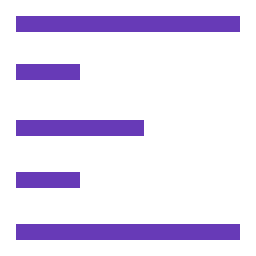
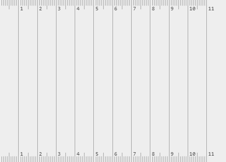

# ruler

[![Dependency Status][depstat-image]][depstat-url]
[![DevDependency Status][depstat-dev-image]][depstat-dev-url]

> Portable screen ruler

Demo: [vovanr.github.io/ruler][demo]

## License
MIT © [Vladimir Rodkin](https://github.com/VovanR)

[demo]: https://vovanr.github.io/ruler

[depstat-url]: https://david-dm.org/VovanR/ruler
[depstat-image]: https://david-dm.org/VovanR/ruler.svg?style=flat-square

[depstat-dev-url]: https://david-dm.org/VovanR/ruler
[depstat-dev-image]: https://david-dm.org/VovanR/ruler/dev-status.svg?style=flat-square
